## What is AnyLog?

AnyLog provides real-time visibility and management of distributed edge data, applications, and infrastructure. It 
transforms the edge into a scalable data tier optimized for IoT workloads, enabling organizations to generate real-time 
insights across industries such as manufacturing, utilities, oil and gas, retail, robotics, smart cities, and automotive.

When deployed on edge nodes, AnyLog forms a peer-to-peer (P2P) network in which each node contributes data and compute 
resources. This network allows applications to access distributed IoT data through a **single query point**, as if the 
data were stored on a single system.

The architecture consists of two complementary layers:
* Physical layer – manages and processes data locally on edge nodes.
* Virtualized data layer – provides unified access to distributed datasets across the network.

Together, these layers create a cloud-like architecture for distributed edge and IoT data, enabling real-time data access 
without requiring data movement and without locking organizations into specific clouds, applications, or hardware.


<a href="https://github.com/EdgeLake/EdgeLake" target="_blank">EdgeLake</a> is the open-source version of AnyLog, 
distributed by the Linux Foundation. It provides most — but not all — of AnyLog's functionality.

---

## EdgeLake vs AnyLog

| Feature | EdgeLake | AnyLog |
|---|---|---|
| Cost | Free / Open-Source | Subscription |
| Virtual edge layer | ✅ | ✅ |
| Rule engine | ✅ | ✅ |
| Policy-based data management | ✅ | ✅ |
| Node management | ✅ | ✅ |
| Unified APIs, CLIs, Admin UI | ✅ | ✅ |
| Supported IoT connectors | ✅ | ✅ |
| Blockchain abstraction | ✅ | ✅ |
| MCP Integration | ✅ | ✅ |
| Aggregations | ❌ | ✅ |
| Automated Unified Namespace (UNS) | ❌ | ✅ |
| Security protocol & High Availability (HA) | ❌ | ✅ |

---

## Key Terminology

| Term | Definition |
|---|---|
| **Southbound** | Data flowing *in* from devices and sensors, stored into AnyLog |
| **Northbound** | Queries and results flowing *out* to applications |
| **Blockchain** | The metadata layer — tracks nodes, datasets, and configurations across the network |
| **Metadata** | Descriptive information about the data and nodes in the network (not the data itself) |
| **Services** | Components of AnyLog / EdgeLake that can be started and stopped independently |
| **Nodes / Agents** | Running AnyLog instances |
| **Containers** | Docker instances running AnyLog |

---

## Node Types

AnyLog uses a single codebase across all node types. With the exception of 
Operator and Publisher — which are mutually exclusive — any AnyLog node can 
run any combination of services simultaneously.

| Node type | Role | Key characteristic |
|---|---|---|
| [Master](#master-node) | Hosts the metadata ledger | Optional — only needed when not using a blockchain platform. One per network (or HA pair). |
| [Operator](#operator-node) | Stores and serves data | Hosts local databases, answers queries, and receives data from southbound connectors or Publishers. |
| [Publisher](#publisher-node) | Routes data to Operators | Receives data from devices or connectors, resolves the target Operator from the metadata layer, and forwards the data. Does not store data locally. Cannot run on the same node as an Operator. |
| [Query](#query-node) | Orchestrates distributed queries | Receives SQL from applications, fans the query out to relevant Operators, and returns aggregated results. Any node can serve as a Query node — it is a role, not a dedicated machine. |

### The Cluster

Before exploring node types in detail, it helps to understand the **cluster** — the metadata concept that ties them together.

A cluster is a policy on the blockchain, not a running process. It declares 
that one or more Operator nodes are collectively responsible for a specific 
set of tables. Every table in the network belongs to a cluster. This 
membership drives two things:

- **Query routing** — the Query Node uses the cluster to find which Operators 
  hold the data for a given table, then sends the query there.
- **HA replication** — when multiple Operators share a cluster, data written 
  to any one of them is automatically replicated to the others.

---

### Master Node

Stores the network's metadata in a local database, making it available to all 
peer nodes on demand. Acts as a centralized metadata ledger when a blockchain 
platform is not in use.

- **When to use:** Any deployment that does not use a blockchain platform 
  (Optimism, Ethereum, etc.) needs a master node. Using a blockchain is 
  optional but removes the single point of failure.
- **Access:** Must be continuously reachable by all nodes in the network.
- **Location:** Cloud or office machine with stable, consistent connectivity.

---

### Operator Node

The data layer of the network. Operator nodes host the actual databases — SQL 
or NoSQL — where time-series and event data is stored and indexed. They respond 
directly to queries fanned out by Query Nodes.

- **Access:** Must communicate bi-directionally with the Master Node, Query 
  Nodes, and peer Operators within the same cluster.
- **Location:** Typically at the edge, close to data sources. HA deployments 
  add a cloud-hosted replica in the same cluster.

---

### Publisher Node

An optional ingestion router. A Publisher accepts data from multiple sensors 
or devices, looks up the appropriate Operator for each dataset using the 
blockchain metadata, and forwards it. It never writes data to a local database.

Use a Publisher when a single ingestion point needs to distribute data across 
multiple clusters or when you want to decouple data sources from storage 
topology.

> A node cannot run both Operator and Publisher services. Choose one per node.

- **Access:** Must be able to reach the target Operator node(s).
- **Location:** At the edge, alongside or near the data sources.

---

### Query Node

Accepts SQL queries from external applications — typically via REST — and 
coordinates execution across the network. It uses the cluster metadata to 
identify which Operators hold the relevant data, fans the query out in 
parallel, collects partial results, and returns a unified response.

Any node can serve as a Query Node by enabling the REST service and the query 
thread pool. A dedicated Query Node is recommended for production workloads 
handling high query volumes.

- **Access:** Must have network access to all Operator nodes it may query.
- **Location:** Same network considerations as the Master Node — cloud or 
  office with reliable connectivity.
---

## Network Architecture

### Data Flow Overview

The diagram below represents the logical flow of data and metadata across an AnyLog network.

```
  [ Sensor / Device ]
         │
         ▼
  [ Publisher Node ]  (optional — distributes data across operators)
         │
    ┌────┴────┐
    ▼         ▼
[ Operator ] [ Operator ]   ←──── [ Master Node / Blockchain Emulator ]
    ▲         ▲                         (metadata sync, dotted lines)
    └────┬────┘
         │
  [ Query Node ]
         │
         ▼
  [ User Application ]
```

**Roles at a glance:**

- The **Master Node** holds metadata for the entire network. Metadata is auto-generated as data arrives (node policies, table definitions, cluster mappings).
- The **Publisher Node** (optional) accepts raw sensor data and routes it to the correct operator nodes.
- **Operator Nodes** store the actual data. Together they form a virtual data lake.
- The **Query Node** receives requests from applications, uses metadata from the blockchain to locate the data, and assembles the final result.

### Traditional vs AnyLog Approach

**Traditional approach:**
Data travels from sensors → edge hardware → cloud before it is accessible to applications. "Real-time" dashboards often carry a significant hidden delay. Accessing edge data typically requires proprietary software tightly coupled to specific devices.

**With AnyLog / EdgeLake:**
Each edge data server becomes an operator node, directly part of the queryable network. Multiple operator nodes together form a virtual data lake. Applications connect to a single query node — not to each data source individually — and AnyLog handles locating and retrieving the data using blockchain metadata. This removes the complexity of managing multiple connections, eliminates the need to know where data physically resides, and dramatically reduces latency.



### Application-Facing Architecture

A typical deployment seen by an application looks like this:

```
  [ Customer Application ]
           │
           ▼
    [ Query Node ]
     /     |      \
    ▼      ▼       ▼
[Edge  ] [Edge  ] [Cloud /
 Op. I]  Op. II]  Historical Op.]
```

The application connects only to the query node. AnyLog routes each request to the appropriate operator(s) automatically, returning a unified result regardless of how many nodes or locations are involved.

---

## The Blockchain Layer

AnyLog uses a blockchain as a non-mutable ledger of metadata transactions across the peer-to-peer network.

**Key points:**

- **Data is not stored on the blockchain.** Raw data lives on operator nodes. The blockchain stores only metadata — node policies, table definitions, cluster assignments, and similar configuration records.
- Because the ledger is non-mutable, it ensures trust and consistency among all participants without a single point of failure.
- Operator, query, and publisher nodes synchronize their configurations via the blockchain, so the network self-organizes as nodes join or leave.

---

## How Data is Collected (Southbound)

| Method | Description |
|---|---|
| **REST PUT** | AnyLog maps the request to a DB, table, and key/value pairs |
| **REST POST** | AnyLog consumes messages and applies mapping to DB tables |
| **Remote Message Broker** | Kafka / MQTT — AnyLog subscribes and applies mapping to DB tables |
| **Local Message Broker** | AnyLog itself acts as the MQTT broker |
| **OPC-UA / EtherIP** | Values stored in timestamp/value format for time-series data |
| **gRPC** | Used for KubeArmor, monitoring tools, and video/inference streaming |

The mapping layer ensures all incoming messages or streams are translated into the correct database structure so data is immediately queryable.

AnyLog supports a **Universal Namespace (UNS)** — either built-in or customer-defined — providing consistent variable names across all nodes. EdgeLake does not include a built-in UNS.

---

## How Querying Works

Querying across the network relies on two independent components:

**Part 1 — Metadata sync**
A background process continuously synchronizes metadata between the blockchain (emulator) and each node in the network, particularly query nodes. This keeps routing information current as the network changes.

**Part 2 — Query execution**

1. A user sends a `SELECT` request to the query node (typically via REST).
2. The query node uses its local copy of the blockchain metadata to identify which operator node(s) hold the relevant data.
3. The query node distributes the request. For aggregate queries (e.g. `SELECT avg(...)`), each operator computes partial results (`sum`, `count`) and returns them to the query node, which assembles the final answer.
4. The result is returned to the application.

This means applications never need to know where data is physically stored — that concern is fully handled by the AnyLog network.
