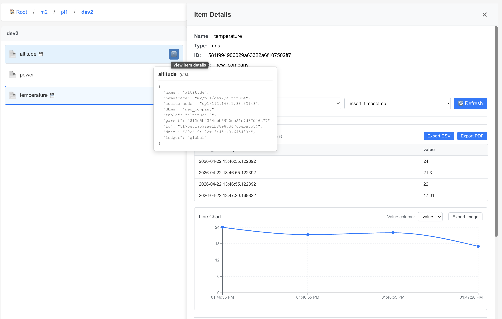

<!--
## Changelog
- 2026-04-18 | Created document; covers UNS concept, auto-generated vs user-defined, dynamic=true ingestion, and UNS policy structure
-->

# Unified Namespace

A <a href="https://www.iiot.university/blog/what-is-uns%3F" target="_blank">Unified Namespace (UNS)</a> is a modeling 
tool for organizing and representing physical or logical assets in a structured hierarchy — similar in purpose to 
Historian Asset Frameworks, but designed for decentralized, real-time operational environments.

Unlike traditional architectures where operational data must be centralized before it becomes broadly accessible, 
AnyLog's UNS enables systems to interact with data as it is generated across the network. This creates a single, 
consistent view of operational data that can be accessed by multiple applications simultaneously — without 
requiring large-scale data movement.

From AnyLog's point of view, a UNS is metadata about the actual data stored on the blockchain. It is up to the 
user to decide how and where to use it within their infrastructure.


---

## Auto-Generated vs. User-Defined

AnyLog supports two approaches to UNS creation, which can be used independently or together.

**Auto-generated UNS** — when data arrives dynamically via MQTT, OPC-UA, or other formats, AnyLog builds a 
hierarchical structure automatically from the topic or path of the incoming data. This lets users drill down 
the namespace tree to find any data point without any manual configuration.

**User-defined UNS** — users can define their own hierarchical structure explicitly. This supports data sources 
that don't arrive dynamically and gives teams the ability to model assets in a way that reflects their own 
organizational or project structure. This is an ability most historians do not support.

The UNS structure can follow a rigid standard like <a href="https://www.isa.org/standards-and-publications/isa-standards/isa-95-standard" target="_blank">ISA-95</a>, 
or a more flexible project-defined hierarchy. Because AnyLog treats the UNS as a type of metadata, both approaches can 
coexist — a dynamically generated namespace can be extended or paralleled with additional user-defined context.

For a working example of hand-authored UNS policies (ex. ISA-95 metadata) see  , see [Custom UNS (data stream, ISA-95)](UNS_custom.md).

---

## Ingesting Data with `dynamic=true`

When setting `dynamic=true` in a `run msg client` command, the MQTT message client switches from mapping-based 
processing to scalar-value processing — similar to how OPC-UA data is handled.

In this mode, AnyLog expects each incoming message to carry a **single scalar value** (integer, float, string, 
or boolean) rather than a full JSON payload. The topic path itself becomes the namespace, and AnyLog 
automatically generates a UNS hierarchy from it.

```anylog
<run msg client where
    broker = 172.104.228.251 and port = 1883 and
    user = anyloguser and password = mqtt4AnyLog! and
    master_node = !ledger_conn and log = false and
    topic = (
        name = "Enterprise C/tff/PCV7X/#" and
        dbms = !default_dbms and
        dynamic = true
    )>
```

In the example above, the `#` wildcard subscribes to all topics under `Enterprise C/tff/PCV7X`. 

Each arriving message — for example `Enterprise C/tff/PCV7X/percent` with value `50` — is stored directly using the 
topic path as the namespace address, with no mapping policy required. 

`dynamic=true` topic configuration tells the message client to not only store the data, but also automatically crate
a UNS structure for it as part of the the blockchain's metadata. 


### Example: ProveIt virtual factory (authenticated MQTT)

The **ProveIt** demo MQTT broker **`virtualfactory.proveit.services`** exposes read-only credentials. Point **`master_node`** at your AnyLog master (here **`192.168.1.88:32048`**). Use **`dynamic=true`** on topic **`Enterprise B/Metric/input/#`** and logical DBMS **`new_company_b`** (connect that DBMS on the operator before starting the client, if needed).

```anylog
<run msg client where
    broker = virtualfactory.proveit.services and port = 1883 and
    user = proveitreadonly and password = proveitreadonlypassword and
    master_node = !ledger_conn and
    topic = (
        name = "Enterprise B/Metric/input/#" and
        dbms = new_company_b and
        dynamic = true
    )>
```

### Example: Mosquitto (dev) on a LAN broker

[Mosquitto](https://mosquitto.org/) is a common MQTT broker for local development. In this pattern, Mosquitto listens on **`192.168.1.88:1883`**, and the AnyLog **master** (ledger) is reachable at **`192.168.1.88:32048`**. Connect the logical DBMS on the operator, then start the message client with **`dynamic=true`** so topic paths under **`M2/PL1/`** drive auto-generated UNS and storage under **`new_company`**.

```anylog
connect dbms new_company where type = sqlite
```

```anylog
<run msg client where
    broker = 192.168.1.88 and port = 1883 and
    master_node = !ledger_conn and
    topic = (
        name = M2/PL1/# and
        dbms = new_company and
        dynamic = true
    )>
```

With the [Mosquitto clients](https://mosquitto.org/download/) installed, you can publish scalar payloads to the same broker for testing (`-m` is the message body, `-t` is the topic):

```bash
mosquitto_pub -p 1883 -h 192.168.1.88 -m 98.3 -t M2/PL1/DEV1/power
mosquitto_pub -p 1883 -h 192.168.1.88 -m 1 -t M2/PL1/DEV1/active
mosquitto_pub -p 1883 -h 192.168.1.88 -m "stopped" -t M2/PL1/DEV1/status
```

On the operator, **`get msg client`** shows the subscription, message counters, and how **`dynamic=true`** materialized topics into tables under **`new_company`**:

```text
AL op1 > get msg client

Subscription ID: 0001
User:         unused
Broker:       192.168.1.88:1883
Connection:   Connected

     Messages    Success     Errors      Last message time    Last error time      Last Error
     ----------  ----------  ----------  -------------------  -------------------  ----------------------------------
             32          32           0  2026-04-22 13:41:43

     Subscribed Topics:
     Topic                Dynamic QOS DBMS        Table      Column name Column Type Mapping Function Optional Policies
     --------------------|-------|---|-----------|----------|-----------|-----------|----------------|--------|--------|
     M2/PL1/#            |True   |  0|new_company|          |           |           |                |        |        |
     M2/PL1/DEV1         |True   |  0|new_company|dev1_1    |           |           |                |        |        |
     M2/PL1/DEV1/power   |True   |  0|new_company|power_1   |           |           |                |        |        |
     M2/PL1/DEV1/active  |True   |  0|new_company|active_1  |           |           |                |        |        |
     M2/PL1/DEV1/status  |True   |  0|new_company|status_1  |           |           |                |        |        |
     M2/PL1/DEV1/altitude|True   |  0|new_company|altitude_1|           |           |                |        |        |

AL op1 >
```

**`get streaming`** shows streaming statistics for the same dynamic tables (rows staged, buffer fill, time until the next process cycle):

```text
AL op1 > get streaming


Statistics
                       Put    Put     Streaming Streaming Cached Counter    Threshold   Buffer   Threshold  Time Left Last Process
DBMS-Table             files  Rows    Calls     Rows      Rows   Immediate  Volume(KB)  Fill(%)  Time(sec)  (Sec)     HH:MM:SS
----------------------|------|-----|-|---------|---------|------|----------|-----------|--------|----------|---------|------------|
new_company.power_1   |     0|    0| |       17|       17|     0|         0|         10|     0.0|        10|       10|00:01:19    |
new_company.active_1  |     0|    0| |        3|        3|     0|         0|         10|     0.0|        10|       10|00:06:33    |
new_company.status_1  |     0|    0| |        2|        2|     0|         0|         10|     0.0|        10|       10|00:07:00    |
new_company.altitude_1|     0|    0| |       10|       10|     0|         0|         10|     0.0|        10|       10|00:01:16    |

AL op1 >
```

In the **Remote GUI**, the same dynamic hierarchy appears as a drill-down tree — for example **`Root / m2 / pl1 / dev2`** with leaves such as **`altitude`**, **`power`**, and **`temperature`**. **Item Details** shows recent scalar samples and a chart for the selected metric. Hovering a leaf surfaces the **`uns`** policy: **`namespace`** (for example **`m2/pl1/dev2/altitude`**), **`dbms`** (**`new_company`**), **`table`** (**`altitude_2`**), and **`source_node`** (**`op1@192.168.1.88:32148`**), consistent with ingestion from the operator on **`192.168.1.88`**.



The **`#`** multi-level wildcard subscribes to every topic under `M2/PL1/` (for example `M2/PL1/temperature` with a scalar payload). Replace host, ports, topic prefix, **`dbms`**, and **`master_node`** with the values for your environment (you can use **`master_node = !ledger_conn`** if that is already set in the dictionary).

| Mode | Input format | Schema required | UNS generated |
|:---|:---:|:---:|:---:|
| Inline mapping | Full JSON | Yes (inline) | No |
| Policy mapping | Full JSON | Yes (policy) | No |
| `dynamic=true` | Scalar value | No | Yes (auto) |

> For mapping-based ingestion, see [Mapping Policies](mapping-policies.md).

---

## UNS Policy Structure

Whether auto-generated or user-defined, each level of the namespace hierarchy is represented as a `uns` policy 
stored on the blockchain. Each policy captures the node's name, its full namespace path, its level in the 
hierarchy, and — at the lower levels — the database and table where the data lives.

### Hierarchy levels

A typical UNS follows four levels:

| Level | Description |
|:---|:---|
| `enterprise` | Top-level organizational unit |
| `namespace` | A system, process, or site within the enterprise |
| `device` | A physical or logical device within the namespace |
| `sensor` | An individual measurement point on a device |

### Example policies

The following shows the UNS policies generated for `Enterprise C / tff / PCV7X / percent`:

**Enterprise level:**
```json
{
    "uns": {
        "name": "Enterprise_C",
        "namespace": "Enterprise_C",
        "id": "b992dcf093661dc3dc966c6a420ac816",
        "date": "2026-02-16T19:13:14.831323Z",
        "ledger": "global"
    }
}
```

**Namespace level** — links to a database and table:
```json
{
    "uns": {
        "name": "tff",
        "namespace": "Enterprise_C/tff",
        "parent": "b992dcf093661dc3dc966c6a420ac816",
        "dbms": "manufacturing_historian",
        "table": "tff",
        "id": "2d8e35eaf0df9bfbdec0d112a410f24e",
        "date": "2026-02-16T19:13:33.860259Z",
        "ledger": "global"
    }
}
```

**Device level:**
```json
{
    "uns": {
        "name": "PCV7X",
        "namespace": "Enterprise_C/tff/PCV7X",
        "parent": "2d8e35eaf0df9bfbdec0d112a410f24e",
        "dbms": "manufacturing_historian",
        "table": "tff_pcv7x",
        "id": "9a08e1c52440638803215c0c61b9d27d",
        "date": "2026-02-16T19:13:33.981368Z",
        "ledger": "global"
    }
}
```

**Sensor level** — the leaf node where data is ultimately stored:
```json
{
    "uns": {
        "name": "percent",
        "namespace": "Enterprise_C/tff/PCV7X/percent",
        "parent": "9a08e1c52440638803215c0c61b9d27d",
        "dbms": "manufacturing_historian",
        "table": "tff_pcv7x_percent",
        "id": "5862ae8e36ad8720baea8f3d10ea31a2",
        "date": "2026-02-16T19:13:34.098449Z",
        "ledger": "global"
    }
}
```

Each policy links to its parent via `parent` (the parent policy's `id`), forming a traversable tree. Because 
these policies live on the blockchain, the hierarchy is immutable and consistent for any consumer — whether 
that's an analyst, a monitoring dashboard, or an AI agent — regardless of whether the underlying device has 
changed its name, IP address, or hardware vendor.

---

## Why This Matters

The practical value of UNS becomes clearest when thinking about who — or what — is consuming the data. 
People are generally forgiving about data formats, but AI and automation systems perform significantly better 
when data is returned in a consistent, predictable structure.

AnyLog addresses this in two ways:

All data retrieval from nodes happens through SQL queries against the network. The interface is always the same 
regardless of what's underneath — whether blob data stored in S3-compatible buckets or time-series data in 
SQLite or PostgresSQL.

The UNS lives in the metadata layer on the blockchain, which means it is guaranteed to be present and 
consistent for anyone querying the system. This allows both users and AI agents to reliably drill down to 
information about a specific device or sensor — even if that device has changed its name, IP, or manufacturer 
(for example, switching from a Siemens PLC to a Schneider).

Combining this with AnyLog's decentralized architecture removes the bottleneck of routing data through a 
central platform, so analytics can happen where the data lives, at the speed it is being generated.