<!--
## Changelog
- 2026-04-17 | Created document
--> 

Qlik is a data integration, analytics, and artificial intelligence platform. Using their <a href="https://help.qlik.com/en-US/connectors/Subsystems/REST_connector_help/Content/Connectors_REST/REST-connector.htm" target="_blank">REST connector plugin</a>, 
users are able to pull data from AnyLog/EdgeLake and use it to generate insight on their data. 

## Requirements 
1. An active AnyLog network 
2. A subscription with Qlik 

## Preparing the Environment   
1. From _Home_ go to _Create_
2. In _Create_ select _Analytics App_
3. Data is coming from _Files & Other Data Sources_

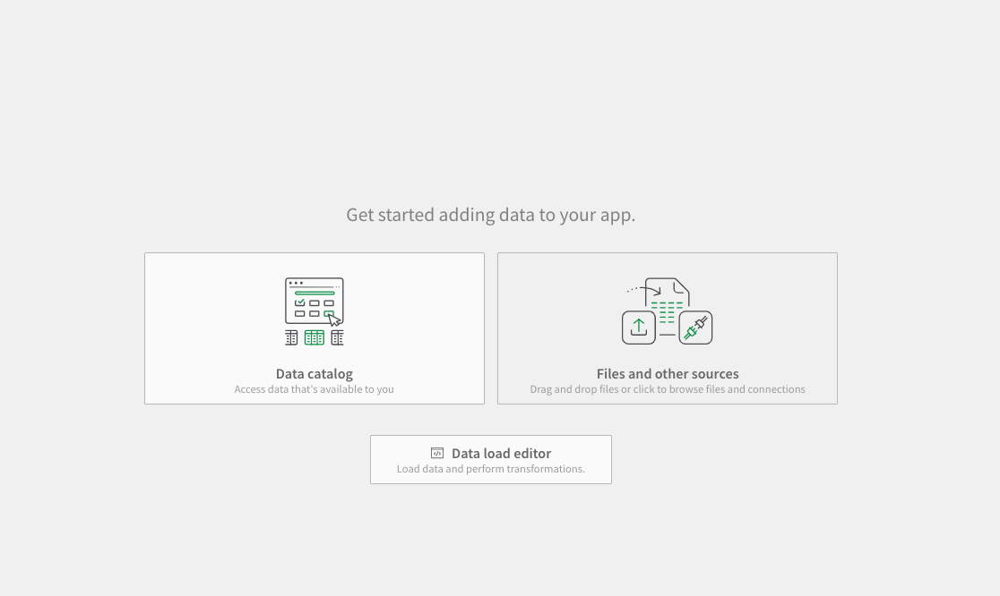

4. Select _REST_ as the data source type

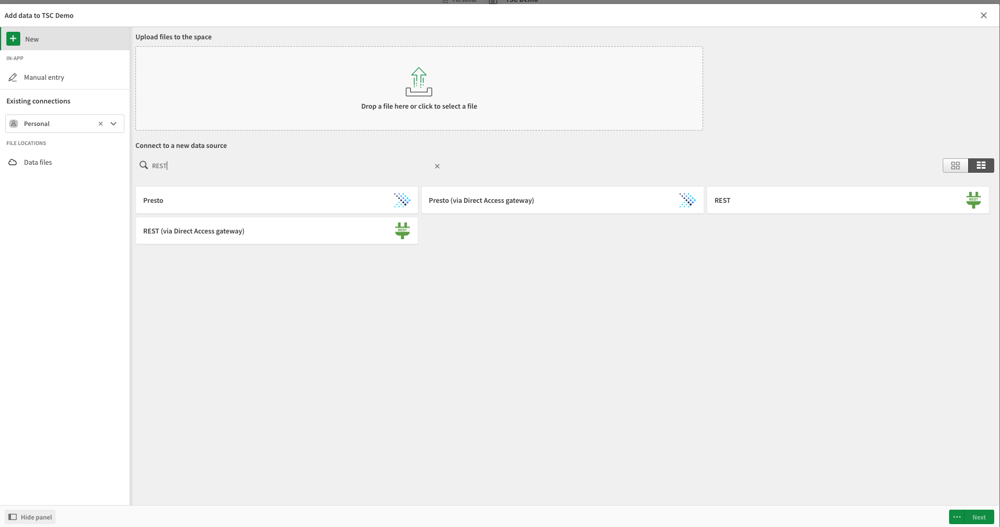

For this demo we'll be creating REST connections for the _increments_ and _period_ functions respectively.
The main components of the REST interface are the URL bar and cURL request headers.

| Qlik REST URL config | Qlik REST header config |
|---------------------|------------------------|
| 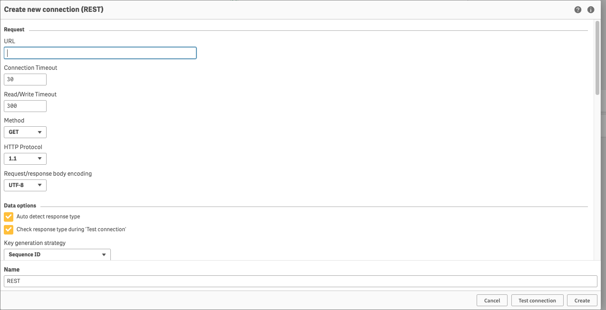 | 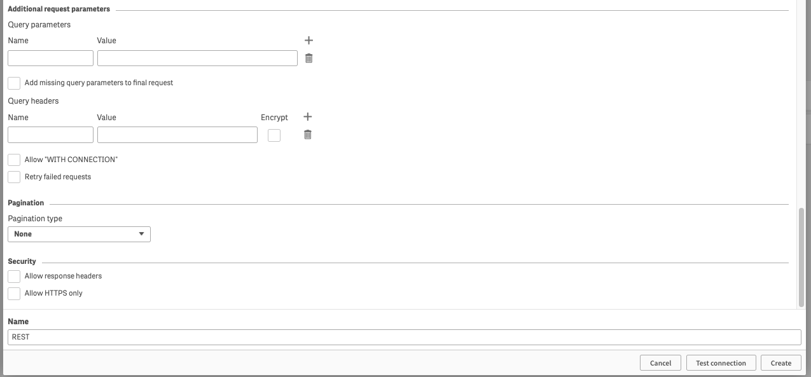 |

## Increments Data 
The [increments function](../queries.md#the-increment-function) segments time-series data into fixed, contiguous 
time intervals (e.g., every 5 minutes, every hour, every day).

1. Set the URL to the REST IP and port of the AnyLog node to query

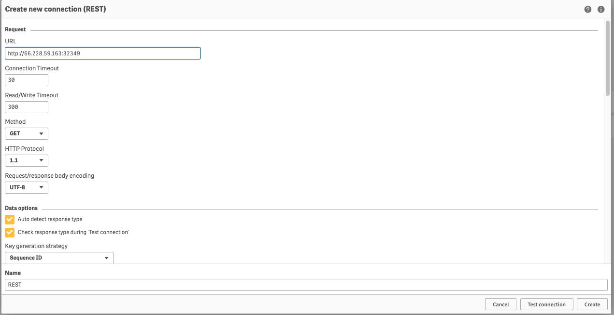
 
2. In the headers section add the following parameters: 
    * **command**: `sql nov format=json and stat=false and include=(t2) and extend=(@table_name) "select increments(second, 1, timestamp), min(timestamp) as timestamp, min(value) as min_val, avg(value) as avg_val, max(value) as max_val from t1 WHERE timestamp >= NOW() - 15 minutes ORDER BY timestamp"`
    * **User-Agent**: `AnyLog/1.23`
    * **destination**: `network`

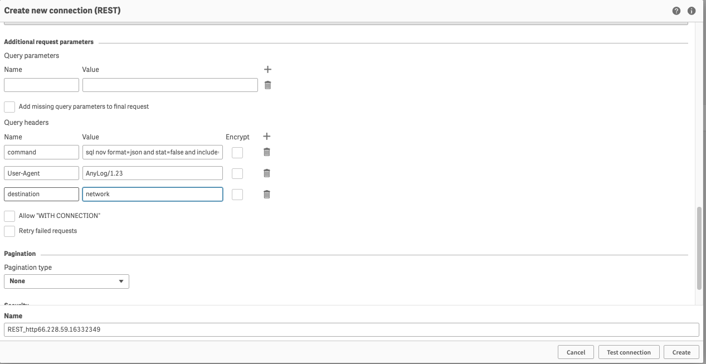

3. Validate the data and continue

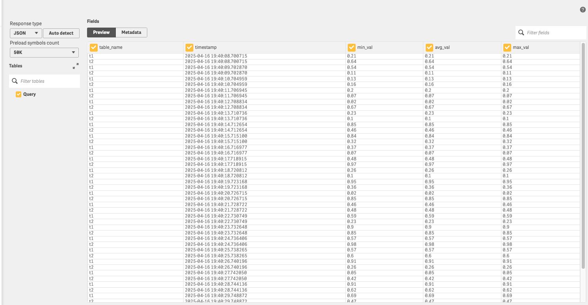

4. Create a new Analytics app

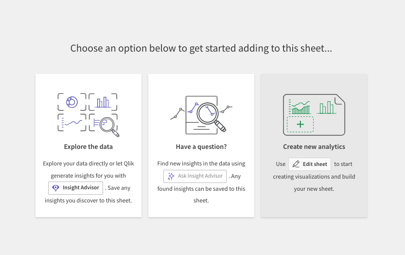

5. Create a graph using the available dimensions

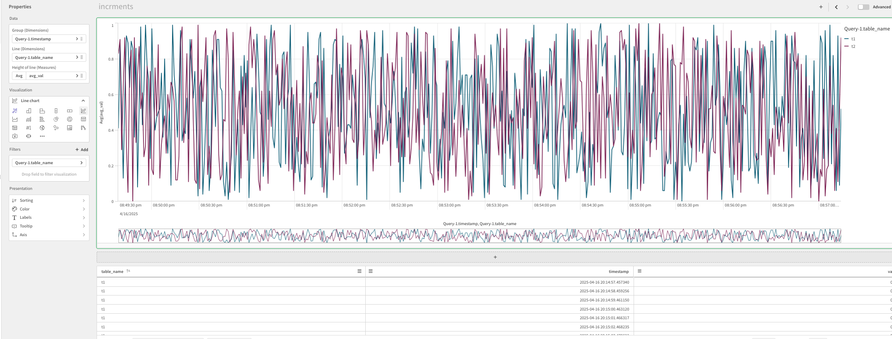

## Period Data 
The [period function](../queries.md#the-period-function) finds the first occurrence of data before or at a specified 
date and considers readings within a time period defined by a type (minutes, hours, days, weeks, months, or years) 
and a unit count (e.g. 3 days).

1. Set the URL to the REST IP and port of the AnyLog node to query

 
2. In the headers section add the following parameters: 
    * **command**: `sql nov format=json and stat=false and include=(t2) and extend=(@table_name) "select timestamp, value from t1 where period(minute, 1, now(), timestamp) order by timestamp"`
    * **User-Agent**: `AnyLog/1.23`
    * **destination**: `network`

3. Validate the data and continue

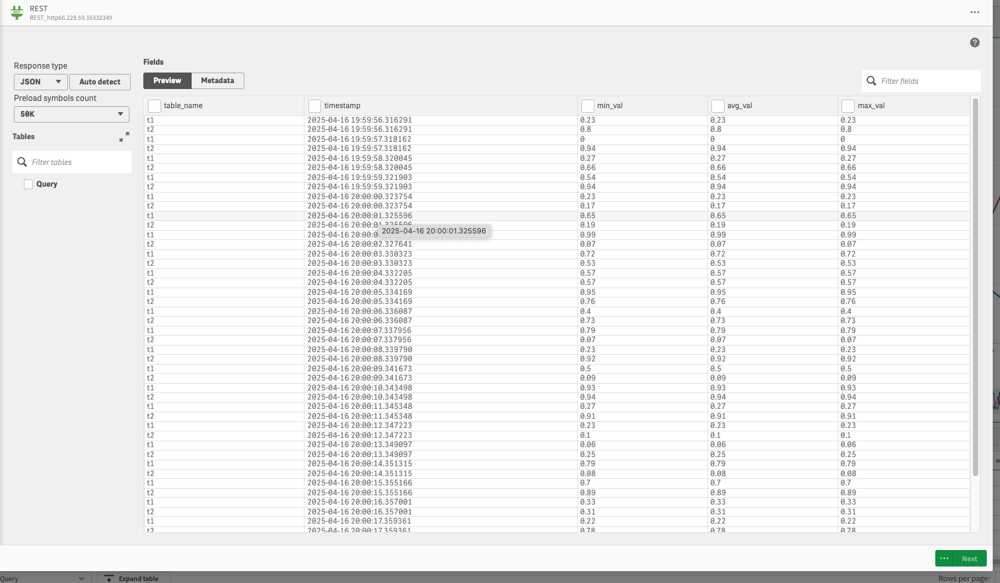

4. Create a new Analytics app

5. Create a graph using the available dimensions

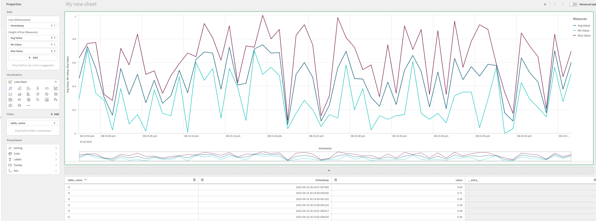