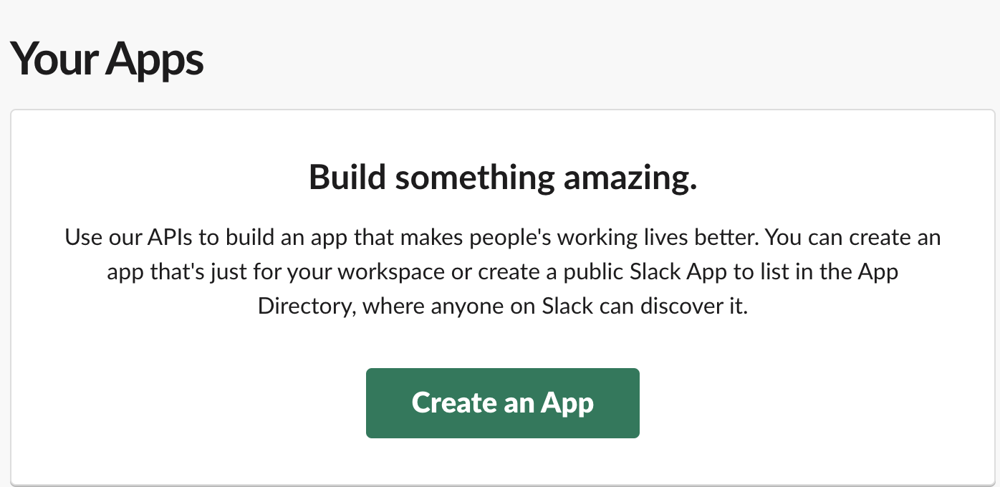
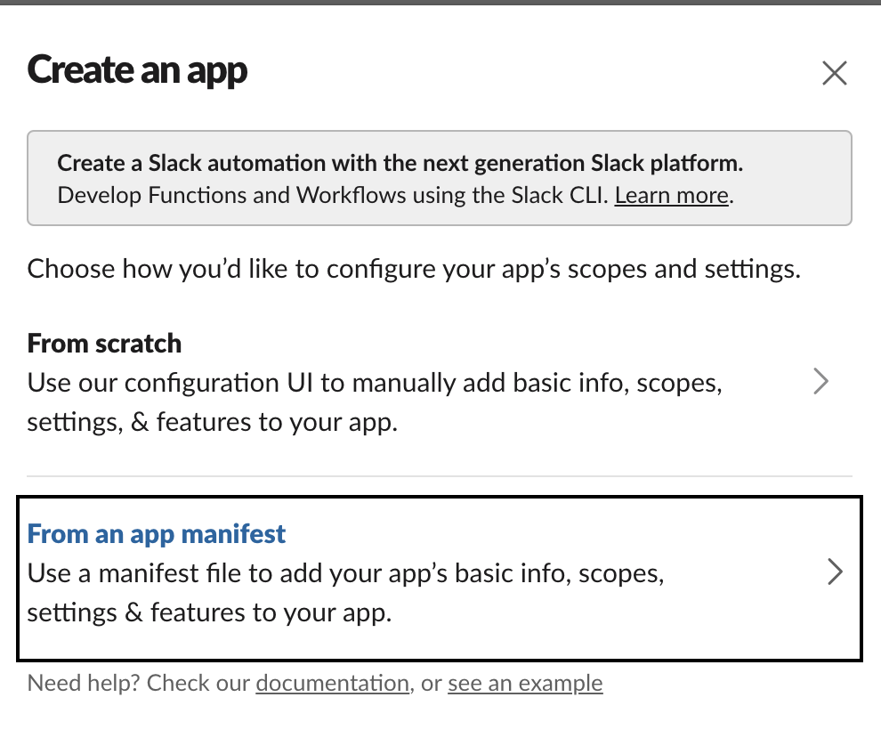
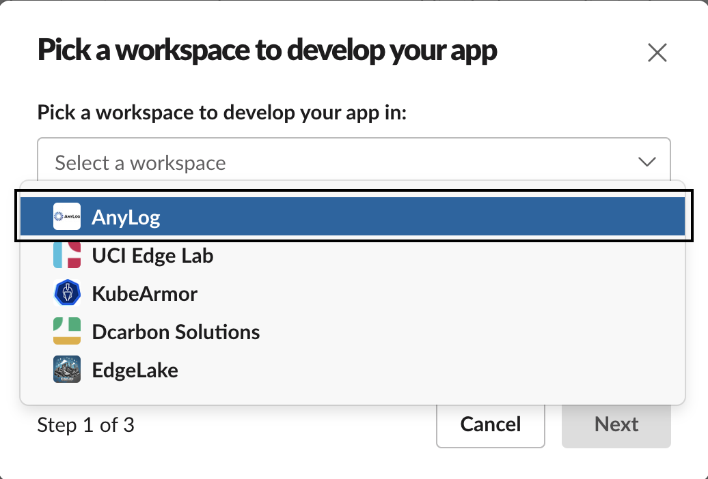
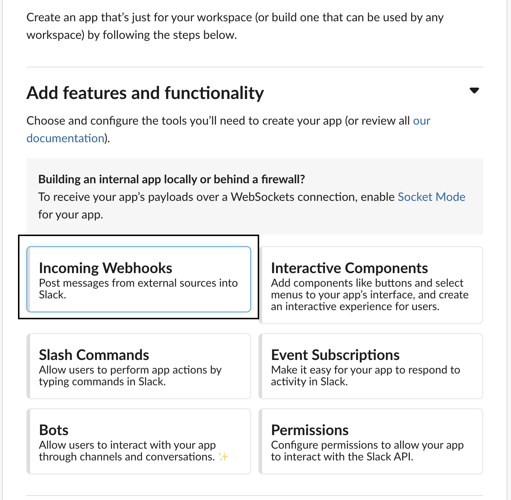
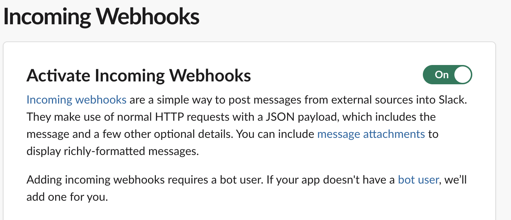
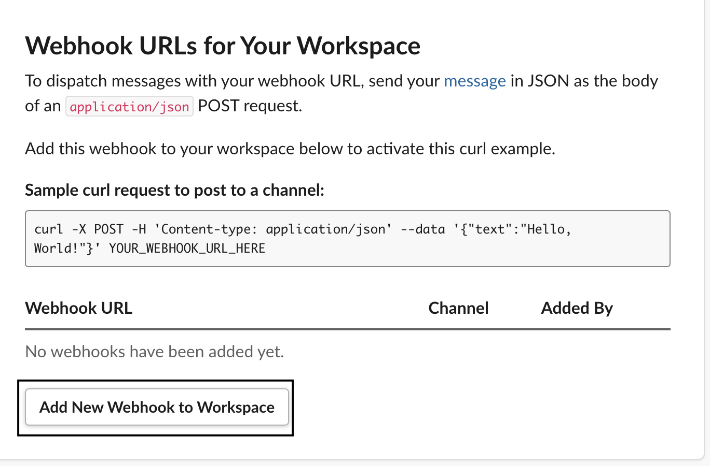
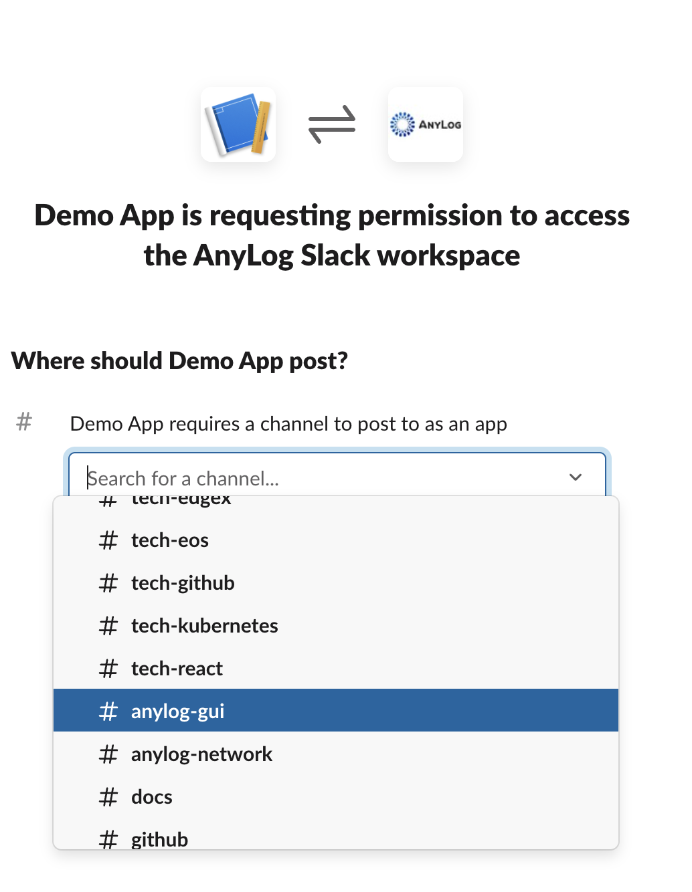
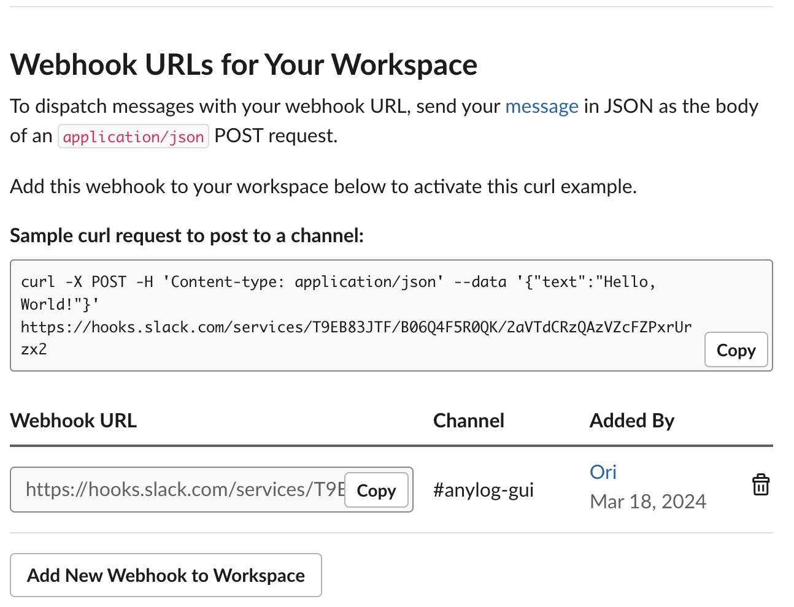

<!--
## Changelog
- 2026-04-17 | Created document
--> 

AnyLog provides services like _REST_, _SMS_ and _STMP_ (eMail) in order allow your network to send notifications regarding 
the system; this can be things like CPU utilization, data not coming in or simply when ever a partition is being dropped / created.


## Setting up Webhooks

_Webhooks_ are user-defined _HTTP_ callbacks that enable real-time communication between web applications; they are the
simplest and fastest way to send messages into third-party applications as it simply uses a _REST_ (post) request as 
opposed to needing to develop a full application for messaging.

* [Slack](https://api.slack.com/messaging/webhooks)
* [Telegram](https://core.telegram.org/bots/api)
* [Pushover](https://pushover.net/api)
* [Discord](https://docs.gitlab.com/ee/user/project/integrations/discord_notifications.html#create-webhook)
* [Microsoft Teams](https://learn.microsoft.com/en-us/microsoftteams/platform/webhooks-and-connectors/how-to/add-incoming-webhook?tabs=newteams%2Cdotnet)
* [Google Hangouts](https://developers.google.com/workspace/chat/quickstart/webhooks)


### Steps
1. Go https://api.slack.com/apps/ 
2. Under _Create_, Create an app from manifest 

|  |  | 
|:------------------------------------------------------------------------------:|:------------------------------------------------------------------------------:|

3. Select the preferred channel 




4. Press continue / next till the end 

5. Select _Incoming Webhooks_



6. Enable Webhooks



7. At the bottom, add _Webbook_ to workspace




8. Select which channel in Slack to send messages to 




9. When done you should see a _webhook_ (URL) - this will be used as part of your REST request in AnyLog




**Generated URL**: 
```URL
https://hooks.slack.com/services/T9EB83JTF/B06Q4F5R0QK/<token> 
```

## Send Notifications via AnyLog

### Slack Webhooks
AnyLog allows to send cURL requests the <a href="{{ '/docs/Querying-Data-Northbound/anylog%20commands/#rest-command' | relative_url }}">_rest_ command</a>. Since _Webhooks_ are 
essentially URLs to send messages into a system, we'll be using the _rest_ command to send notifictaions from AnyLog into
Slack.

1. Create webhook URL as a variable 
```anylog
webhook_url = "https://hooks.slack.com/services/T9EB83JTF/<token>"
```

2. get percentage of CPU used and current timestamp  
```anylog
cpu_percent = get node info cpu_percent
date_time = python "datetime.datetime.utcnow().strftime('%Y-%m-%d %H:%M:%S.%f')"
```

3. Create payload
```anylog
text_msg = !date_time + "  CPU usage: " + !cpu_percent 
payload = json {"text": !text_msg}
```

4. Publish information to Slack via _REST_
```anylog
rest post where url = !webhook_url and body = !payload and headers = "{'Content-Type': 'application/json'}" 
```

Once sent, an output would appear in the proper Slack channel


**Note**: _Google Hangouts_, _Discord_ and _Microsoft Teams_ use `content` for the _payload_ key as opposed to `text`. 

### Telegram

Create a bot via <a href="https://t.me/BotFather" target="_blank">@BotFather</a> to obtain an `API_TOKEN`. Use your `CHAT_ID` (or a group chat ID) as the destination for messages.

```anylog
rest post where url = https://api.telegram.org/bot[API_TOKEN]/sendMessage and headers = {"Content-Type": "application/json"} and body = {"chat_id":"[CHAT_ID]","text":"Door ALARM"}
```

The `text` field in the body can be any alert message. Use this command directly, in a scheduled task, or as the action in a <a href="{{ '/docs/Monitoring-Operations/node-monitoring/#streaming-conditions-real-time-alerts' | relative_url }}">streaming condition</a>.

### Pushover

Register at <a href="https://pushover.net/" target="_blank">pushover.net</a> to obtain an application `API_TOKEN` and a user or group `USER/GROUP_ID`.

```anylog
rest post where url = https://api.pushover.net/1/messages.json and headers = {"Content-Type":"application/json"} and body = {"token":"[API_TOKEN]","user":"[USER/GROUP_ID]","message":"Test 1"}
```

Replace `message` with your alert text. Pushover also supports optional fields such as `title`, `priority`, and `sound` — see the <a href="https://pushover.net/api#messages" target="_blank">Pushover API</a> for the full list.


